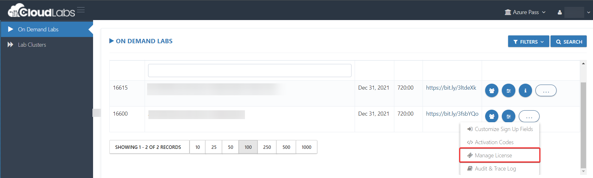
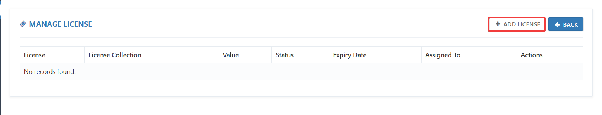
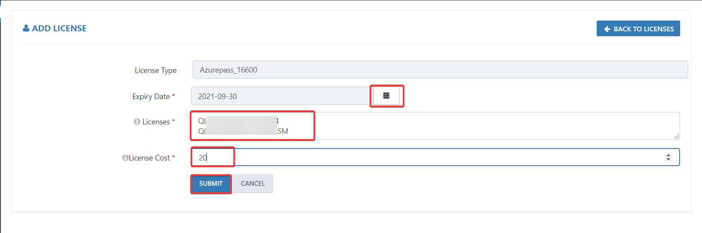
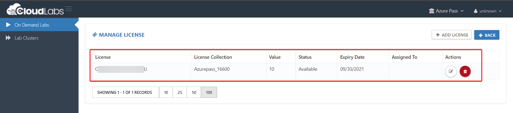
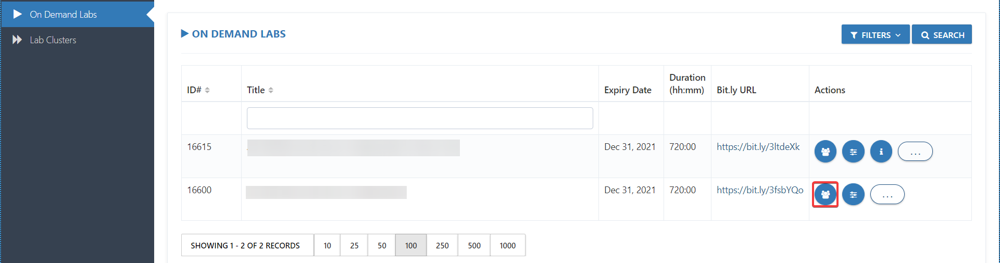
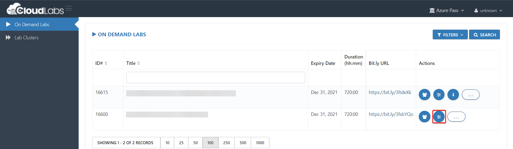

# DP-203: For Instructors
This document is designed to help you manage the users/resources. If you are new to using the CloudLabs platform and would like to have a 15 minutes onboarding training meeting, please request via psm-cloudlabs@spektrasystems.com

## Login to the CloudLabs (Admin Portal)#
Click on the link below to access the walkthrough to Login to CloudLabs Admin Portal.

Include all that is in Access CloudLabs Admin Center

## Managing Licence

Once you access the cloudlabs admin center portal

1. Under On Demand Labs, click on 3 dots and the select click on Manage License

 

2. Click on Add License under Manage License

 

3. Add the following details as per below:

* Expiry Date: Expiration Date of the azure pass code
* Licenses: Add the Azure Pass promo code one by one as show in image
* License cost: Give any number
Click on Submit

 

4. From Manage License you can check the status of licenses.

 

Now user can registor for the lab and use the promo code to perform the lab

### Managing Users
 

### Managing VM and Usage
 

### contact support
